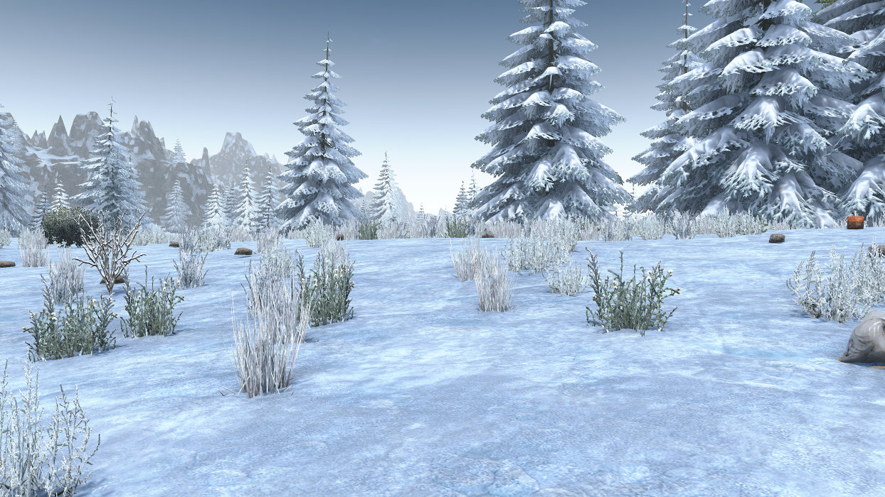

# OCB MicroSplat Snow Demo Mod - Addon for OCB MicroSplat

Spruce up vanilla snow biome by mixing in another texture.

Requires [OcbMicroSplat][1] (Download from [Nexusmods][3]).

You need to disable EAC to use this mod!

## Download and Install

End-Users are encouraged to download my mods from [NexusMods][3].  
Every download there helps me to buy stuff for mod development.

Otherwise please use one of the [official releases][4] here.  
Only clone or download the repo if you know what you do!

## In-Game Screenshots

First screen shows custom biome, second one vanilla:

## Changelog

### Version 0.2.0

- First compatibility with V1.0 (exp)
- Bumped unity version to 2022.3.29f1
- Verified compatibility with V1.0 (b333)

### Version 0.1.0

- Initial version

[1]: https://github.com/OCB7D2D/OcbMicroSplat
[2]: https://github.com/OCB7D2D/OcbMicroSplat/releases
[3]: https://www.nexusmods.com/7daystodie/mods/2873
[4]: https://github.com/OCB7D2D/OcbMicroSplatSnow/releases
